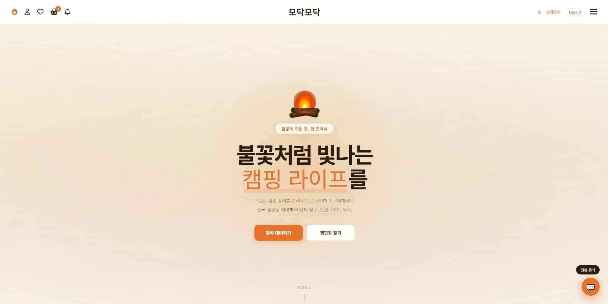
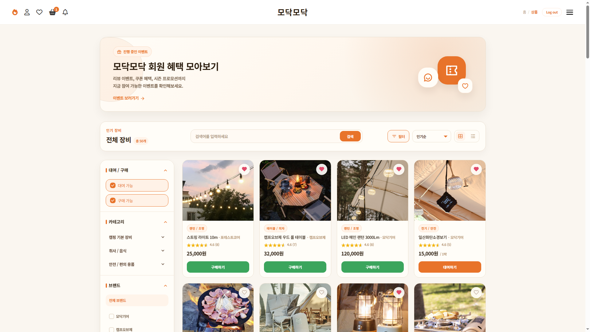
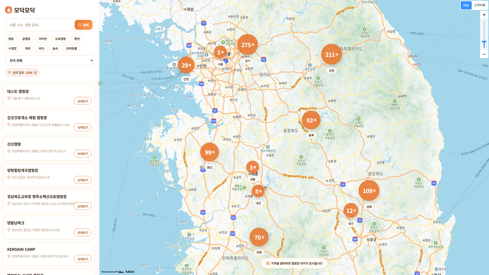

<div align="center">


<br>

[](https://spring.io/projects/spring-boot)
[](https://www.java.com)
[](https://www.mysql.com)
[](https://www.oracle.com/java/technologies/jspt.html)
[](https://deepmind.google/technologies/gemini/)
[](https://docs.tosspayments.com)

<br>

> 🗓 **개발 기간** : 2026.04.08 ~ 2026.04.30 &nbsp;&nbsp;|&nbsp;&nbsp; 👥 **팀 구성** : 4인 팀 프로젝트

<br>

<!-- 대표 이미지 -->


</div>

<br>

---

## 📌 프로젝트 소개

**모닥모닥(ModakModak)** 은 캠핑장 정보 조회, 장비 대여 및 구매, 커뮤니티까지 한 곳에서 해결하는 **종합 캠핑 플랫폼**입니다.

Spring Boot + MyBatis를 기반으로 구축되었으며, Google Gemini AI · 카카오맵 · 공공데이터 · 기상청 · Toss Payments 등 **다양한 외부 API**를 연동하여 실제 서비스에 가까운 완성도를 목표로 개발하였습니다.

```
🏕️  캠핑장 탐색   →   🛒  장비 렌탈/구매   →   💬  커뮤니티 소통   →   ⚙️  관리자 운영
```

<br>

---

## 📸 서비스 화면

<div align="center">


<br><br>



<br><br>



</div>

<br>

---

## 👥 팀원 소개

<div align="center">

| 이름 | 역할 | GitHub |
|:---:|:---|:---:|
| **소채연** | `팀장` · 외부 API 연동 · 인증 아키텍처 설계 | [](https://github.com/sochaeyeon) |
| **김은동** | `풀스택` · 인프라 · 어드민 시스템 설계 | [](https://github.com/rladmsehd135) |
| **임예림** | `풀스택` · UI/UX 설계 · 이커머스 로직 | [](https://github.com/kewiibird-source) |
| **필우청** | `풀스택` · 데이터 모델링 · 고객 지원 시스템 | [](https://github.com/yuqingtangda) |

</div>

<br>

---

## 📂 관련 문서

<div align="center">

| 문서 | 설명 | 링크 |
|:---:|:---|:---:|
| 📝 **회의록** | 주간 회의 내용 및 결정 사항 기록 | [바로가기 →](https://drive.google.com/drive/folders/14zyi4NPYp5hNNngEVUll3zfDjJBpoXgU) |
| 📐 **설계 문서** | ERD, 요구사항 정의서, API 명세서 | [바로가기 →](https://drive.google.com/drive/folders/1ImcpHUeuDkVdmN7kLwLxJ86gxVyfqsfu) |
| 🛠️ **공통 가이드라인** | 코드 컨벤션, 브랜치 전략, 공통 규칙 | [바로가기 →](https://drive.google.com/drive/folders/1fBHTVU46fD2LCtV5VhgCbF-mRSP53oqj) |
| 🎞️ **발표 PPT** | 프로젝트 최종 발표 슬라이드 | [바로가기 →](https://drive.google.com/drive/folders/1HiUoiXSteg3I6RIs6ugyEuQGllCwXxJs) |
| 🎞️ **시연영상** | 프로젝트 최종 시연 영상 | [바로가기 →](https://drive.google.com/drive/folders/1Pk6suZSuB2UOuNgl-HHGSGlxJqbb_u0o?usp=drive_link) |
| 🗂️ **ERD** | ERD Cloud 다이어그램 | [바로가기 →](https://www.erdcloud.com/d/mKYg2hEbjCt6jR4kW) |

</div>

<br>

---

## 🛠 기술 스택

### ⚙️ Backend & Infrastructure

| 기술 | 버전 | 용도 |
|:---|:---:|:---|
| Spring Boot | `3.5.12` | 메인 웹 프레임워크 |
| MyBatis | `3.0.5` | SQL 매핑 ORM |
| Java | `17` | 개발 언어 |
| Spring Security + OAuth2 | `-` | 인증 및 소셜 로그인 |
| MySQL (AWS RDS) | `-` | 클라우드 데이터베이스 |

### 🎨 Frontend

| 기술 | 용도 |
|:---|:---|
| JSP (Jakarta Servlet JSP JSTL) | 서버사이드 템플릿 엔진 |
| Vue.js 3 | 동적 UI 컴포넌트 |
| JavaScript (jQuery / AJAX) | 비동기 통신 및 동적 UI |
| CSS3 (Custom Design) | 반응형 웹 디자인 |

### 🌐 External APIs

| 구분 | 기술 |
|:---|:---|
| 🔐 인증 | Google / Naver / Kakao OAuth2, Solapi (SMS 인증) |
| 💳 결제 / 배송 | Toss Payments, Delivery Tracker API |
| 🗺️ 지도 / 데이터 | 카카오맵 API, GoCamping 공공데이터, 기상청 단기예보 API |
| 🤖 AI / 메일 | Google Gemini API, Java Mail (Gmail SMTP) |

<br>

---

## 📁 프로젝트 구조

<details>
<summary><b>📂 전체 디렉토리 구조 펼쳐보기</b></summary>

<br>

```
modak/
├── pom.xml
└── src/main/
    │
    ├── java/com/example/modak/
    │   ├── ModakApplication.java
    │   │
    │   ├── common/                          # 공통 설정 및 보안
    │   │   ├── SecurityConfig.java          # Spring Security 설정
    │   │   ├── WebMvcConfig.java            # MVC 설정, 인터셉터
    │   │   ├── LoginCheckInterceptor.java   # 로그인 인터셉터
    │   │   ├── CustomOAuth2User.java        # 소셜 로그인 유저
    │   │   ├── CustomOAuth2UserService.java
    │   │   ├── OAuth2LoginSuccessHandler.java
    │   │   └── controller/                  # 공통 컨트롤러
    │   │       ├── ErrorController.java
    │   │       ├── WeatherController.java    # 기상청 API
    │   │       ├── TermsController.java
    │   │       └── PrivacyPolicy.java
    │   │
    │   ├── admin/                           # 관리자 시스템
    │   │   ├── controller/AdminController.java
    │   │   ├── dao/AdminService.java
    │   │   └── mapper/AdminMapper.java
    │   │
    │   ├── alarm/                           # 알림
    │   ├── board/                           # 게시판 / 커뮤니티
    │   ├── camp/                            # 캠핑장 (공공데이터 연동)
    │   ├── cart/                            # 장바구니
    │   ├── category/                        # 상품 카테고리
    │   ├── chat/                            # AI 챗봇 (Gemini)
    │   ├── chatroom/                        # 1:1 실시간 채팅
    │   ├── csCenter/                        # 고객센터
    │   │   ├── controller/
    │   │   │   ├── CsCenterController.java
    │   │   │   ├── FaqController.java
    │   │   │   ├── InquiryController.java
    │   │   │   └── NotificationController.java
    │   │   ├── dao/ & mapper/ & model/
    │   │
    │   ├── delivery/                        # 배송 조회 (Delivery Tracker)
    │   ├── event/                           # 이벤트
    │   ├── guide/                           # 캠핑 가이드
    │   ├── main/                            # 메인 페이지
    │   ├── membership/                      # 멤버십 / 등급
    │   ├── order/                           # 주문
    │   │   ├── controller/
    │   │   │   ├── OrderController.java       # 회원 주문
    │   │   │   ├── GuestOrderController.java  # 비회원 주문
    │   │   │   └── OrderExchangeController.java # 교환 신청
    │   │   ├── dao/ & mapper/ & model/
    │   │
    │   ├── payment/                         # 결제 (Toss Payments)
    │   ├── product/                         # 상품
    │   ├── refund/                          # 환불
    │   ├── rental/                          # 대여 연장 / 반납
    │   ├── review/                          # 리뷰
    │   │   ├── controller/
    │   │   │   ├── ReviewController.java
    │   │   │   └── ReviewAiController.java  # AI 리뷰 요약 (Gemini)
    │   │   ├── dao/
    │   │   │   ├── ReviewService.java
    │   │   │   ├── GeminiReviewService.java
    │   │   │   └── GeminiReviewServiceImpl.java
    │   │   └── mapper/ & model/
    │   │
    │   ├── search/                          # 통합 검색
    │   ├── user/                            # 회원
    │   │   ├── controller/
    │   │   │   ├── LoginController.java
    │   │   │   ├── SignUpController.java
    │   │   │   ├── MypageController.java
    │   │   │   ├── UserSettingsController.java
    │   │   │   ├── FindAccountController.java
    │   │   │   ├── SmsAuthController.java   # Solapi SMS
    │   │   │   ├── CouponController.java
    │   │   │   ├── PointHistoryController.java
    │   │   │   └── ViewController.java
    │   │   ├── dao/ & mapper/ & model/
    │   │
    │   └── wishlist/                        # 위시리스트
    │
    ├── resources/
    │   ├── application.properties
    │   └── mybatis-mapper/                  # MyBatis XML 매퍼
    │       ├── admin/sql-admin.xml
    │       ├── board/sql-board.xml
    │       ├── order/sql-order.xml
    │       ├── order/sql-guestorder.xml
    │       ├── order/sql-orderexchange.xml
    │       ├── product/sql-product.xml
    │       ├── rental/sql-rentalextension.xml
    │       ├── review/sql-review.xml
    │       ├── user/sql-login.xml
    │       └── ... (총 40개 XML 매퍼)
    │
    └── webapp/
        ├── WEB-INF/
        │   ├── common/                      # 공통 JSP
        │   │   ├── header.jsp
        │   │   └── footer.jsp
        │   ├── admin/                       # 관리자 화면 (15개)
        │   │   ├── admin-dashboard.jsp
        │   │   ├── admin-members.jsp
        │   │   ├── admin-products.jsp
        │   │   ├── admin-orders.jsp
        │   │   ├── admin-rentals.jsp
        │   │   ├── admin-coupons.jsp
        │   │   └── ...
        │   ├── board/                       # 게시판 JSP
        │   │   ├── board-list.jsp
        │   │   ├── board-detail.jsp
        │   │   ├── board-write.jsp
        │   │   ├── board-edit.jsp
        │   │   ├── chat-list.jsp
        │   │   └── chat-room.jsp
        │   ├── order/                       # 주문 JSP
        │   │   ├── order-history.jsp
        │   │   ├── order-detail.jsp
        │   │   ├── order-exchange.jsp
        │   │   ├── guest-order-list.jsp
        │   │   ├── guest-order-detail.jsp
        │   │   └── guest-order-inquiry.jsp
        │   ├── user/                        # 회원 JSP
        │   │   ├── login.jsp
        │   │   ├── sign-up.jsp
        │   │   ├── mypage.jsp
        │   │   ├── find-account.jsp
        │   │   └── user-profile.jsp
        │   └── ... (총 70개+ JSP)
        │
        ├── css/                             # 스타일시트 (도메인별)
        │   ├── common/
        │   ├── admin/
        │   ├── board/
        │   ├── order/
        │   └── ...
        └── img/                             # 이미지 리소스
            ├── profile/
            ├── board/
            ├── chat/
            └── ...
```

</details>

<br>

---

## 🚀 주요 기능

<details open>
<summary><b>⛺ 캠핑장 & 날씨</b></summary>

<br>

- 🗺️ **카카오맵 API** 기반 전국 캠핑장 위치 확인 및 목록 / 상세 조회
- 🏕️ **GoCamping 공공데이터** 연동 — 전국 캠핑장 정보 실시간 동기화
- 🌤️ **기상청 단기예보 API** — 캠핑장별 맞춤 날씨 정보 제공

</details>

<details>
<summary><b>🛒 쇼핑 & 렌탈</b></summary>

<br>

- 🏷️ 캠핑 용품 **구매 및 대여** 통합 시스템
- 🛒 장바구니, **Toss Payments** 결제, 회원 / 비회원 주문 처리
- 🔑 대여 연장 및 반납 관리 — **비회원 토큰 인증 지원**
- 🚚 **Delivery Tracker API** 실시간 배송 상태 추적

</details>

<details>
<summary><b>💬 커뮤니티 & AI</b></summary>

<br>

- 📋 게시판 (작성 / 수정 / 상세) 및 사용자 간 **1:1 실시간 채팅**
- 🤖 **Google Gemini** 기반 캠핑 가이드 AI 챗봇
- ✨ 상품 리뷰 **AI 자동 요약** (3문장 이내)

</details>

<details>
<summary><b>⚙️ 관리자 시스템</b></summary>

<br>

- 📊 매출 통계 및 실시간 재고 관리 **대시보드**
- 👥 회원 / 상품 / 캠핑장 / 쿠폰 / 리뷰 / 문의 **통합 관리**
- 🔔 공지사항 / 이벤트 / 알림 발송 시스템
- 🔄 주문 취소 승인, 반납 상태 변경, 검수 관리

</details>

<br>

---

## 📋 상세 역할 분담

<details open>
<summary><b>🙂 소채연 — 팀장 / 인증 및 아키텍처</b></summary>

<br>

| 카테고리 | 상세 업무 |
|:---|:---|
| 🔐 **인증 / 계정** | 소셜 로그인 API (Google·Naver·Kakao), 회원가입, SMS 인증 기반 아이디·비밀번호 찾기 |
| 👤 **회원 서비스** | 마이페이지, 멤버십 정보, 포인트·쿠폰 내역, 주문 내역 관리 |
| 📌 **활동 기록** | 최근 본 상품, 위시리스트, 챗봇 기록, 리뷰 전체보기, 통합 검색 |
| 🎧 **고객 지원** | 배송 현황 (택배사 API), 1:1 문의 수정, 리뷰 및 게시글 수정·작성 |
| 🎨 **기타** | 전체 CSS 통합 관리 |

</details>

<details>
<summary><b>😡 김은동 — 풀스택 / 어드민 및 인프라</b></summary>

<br>

| 카테고리 | 상세 업무 |
|:---|:---|
| 🏠 **핵심 서비스** | 메인 페이지, 캠핑장 지도·목록·상세 조회 (시설 정보 포함) |
| 📦 **주문 / 렌탈** | 비회원 주문 조회·상세, 회원·비회원 대여 연장·반납·교환 처리 |
| 💬 **커뮤니티** | 게시판 (목록·상세·작성), 1:1 채팅방 및 목록 관리, AI 챗봇 구현 |
| 🔔 **알림 / 가이드** | 알림 목록·상세, 설치·QR·분리수거 가이드 |
| ⚙️ **Admin 전체** | 대시보드·통계·매출·회원·상품·캠핑장·쿠폰·리뷰·문의·등급·알림·취소 통합 관리 |
| 🎨 **기타** | 담당 화면 CSS 구현 |

</details>

<details>
<summary><b>😀 임예림 — 풀스택 / 이커머스 로직</b></summary>

<br>

| 카테고리 | 상세 업무 |
|:---|:---|
| 🛍️ **상품 서비스** | 상품 목록, 상품 검색 결과, 상품 상세 페이지 구현 |
| 💳 **구매 로직** | 장바구니 관리, Toss Payments 결제 연동, 주문 완료 프로세스 |
| 🔄 **사후 관리** | 환불 요청 및 환불 상세 조회 시스템 |
| ⭐ **리뷰 시스템** | 리뷰 작성·수정, 리뷰 신고 폼 구축 |
| 🎨 **기타** | 담당 화면 CSS 구현 |

</details>

<details>
<summary><b>😂 필우청 — 풀스택 / 고객 지원 및 UI</b></summary>

<br>

| 카테고리 | 상세 업무 |
|:---|:---|
| 🧩 **공통 UI** | 헤더·푸터 레이아웃, 에러 페이지 구성 |
| 🎧 **고객 센터** | 고객센터 메인, FAQ, 1:1 문의 폼 구현 |
| 📄 **정보 / 약관** | 공지사항 (목록·상세), 이용약관, 개인정보처리방침, 마케팅 수신동의 |
| 🎉 **프로모션** | 이벤트 목록 및 이벤트 상세 페이지 관리 |
| 🎨 **기타** | 담당 화면 CSS 구현 |

</details>

<br>

---

## 🌟 기대 효과

<div align="center">

| 구분 | 효과 | 설명 |
|:---:|:---|:---|
| 👤 **사용자** | 🎯 원스톱 솔루션 | 캠핑장 탐색부터 장비 렌탈, 날씨 확인까지 한 번에 해결 |
| 👤 **사용자** | 🤖 스마트한 의사결정 | AI 리뷰 요약으로 방대한 정보를 빠르게 파악 |
| 👤 **사용자** | 💬 실시간 소통 | 커뮤니티와 1:1 채팅으로 캠핑족 간 정보 공유 |
| 🏢 **운영자** | 📊 데이터 기반 관리 | 매출 통계 및 실시간 재고 대시보드로 운영 효율 극대화 |
| 🏢 **운영자** | 💰 비용 절감 | AI 챗봇 및 자동 알림으로 고객 응대 자동화 |
| 🏢 **운영자** | 🔧 높은 확장성 | 모듈화 설계로 부가 서비스 확장 용이 |

</div>

<br>

---

## 🗂️ ERD

<details>
<summary><b>📐 ERD 펼쳐보기 — 초기 29개 → 최종 75개 테이블</b></summary>

<br>

<div align="center">


> 📌 초기 29개 테이블 → 최종 **75개 테이블**로 확장된 데이터 모델

</div>

</details>

<br>

---

<div align="center">


**🔥 모닥불처럼 따뜻한 캠핑 플랫폼, 모닥모닥 🔥**

`Team Modak` · `2026`

</div>
